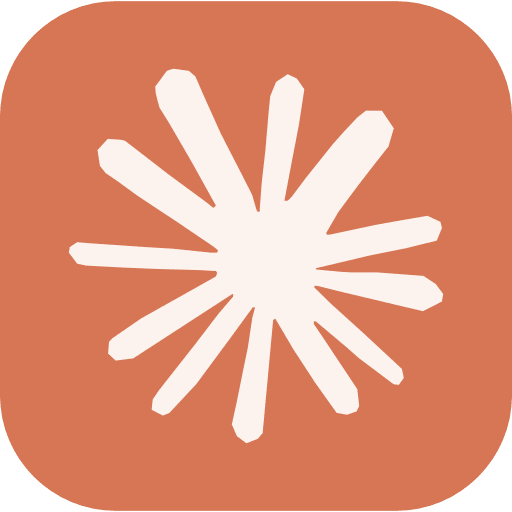

# Todoist Claude Integration (MCP Server)

  
  +
  

Connect your Todoist account to Claude and supercharge your productivity with natural language task management!

---

## 🚀 What is this?

This is a remote [Model Context Protocol (MCP)](https://www.anthropic.com/news/integrations) server that lets you connect [Claude](https://claude.ai/) to your Todoist account. Once connected, you can ask Claude to:

- Add new tasks to Todoist
- List, update, or complete your tasks
- Plan your schedule and manage projects
- Use natural language to interact with your to-do list

All from within Claude, using secure, private integration.

---

## ✨ Features

- **Add tasks**: "Remind me to call Alice tomorrow at 10am."
- **List projects & tasks**: "What are my tasks for today?"
- **Update or complete tasks**: "Mark 'Buy groceries' as done."
- **Full Todoist support**: Projects, labels, priorities, due dates, and more.
- **Secure**: Your Todoist token is stored securely and only used for your requests.

---

## 🛠️ How to Set Up

1. **Get your Todoist API token:**

   - Go to [Todoist Integrations](https://todoist.com/prefs/integrations)
   - Copy your API token

2. **Open the integration setup page:**

   - Visit https://todoist-mcp-server.real-tomer-rosenfeld.workers.dev
   - Paste your Todoist API token and submit

3. **Get your personalized integration URL:**

   - After setup, you'll receive a unique URL for Claude

4. **Add the integration to Claude:**

   - Go to [Claude Integrations](https://claude.ai/settings/integrations)
   - Click "Add Integration" and paste your URL
   - Follow the prompts to connect

5. **Start chatting!**
   - In Claude, say things like:
     - "Add a task to call Bob next Monday."
     - "Show me my tasks for this week."
     - "Complete the task 'Submit report'."

---

## 📚 Resources

- [Anthropic: Integrations Overview](https://www.anthropic.com/news/integrations)
- [Anthropic: Setting up Integrations](https://support.anthropic.com/en/articles/10168395-setting-up-integrations-on-claude-ai)
- [Todoist API Docs](https://developer.todoist.com/rest/v2/)

---

## 🛡️ Privacy & Security

- Your Todoist token is stored securely and never shared.
- This server only accesses your Todoist data to fulfill your requests.
- You can revoke access at any time by removing the integration or resetting your token.

---

## 💬 Support

For help or questions, see the [Anthropic support article](https://support.anthropic.com/en/articles/10168395-setting-up-integrations-on-claude-ai) or contact your integration admin.

---

Happy tasking! ✨
