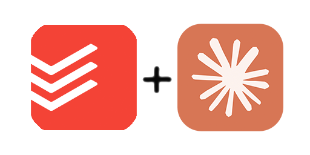

# Todoist MCP Server

A Model Context Protocol (MCP) server that integrates Todoist with Claude AI, enabling direct task management through natural language conversations.

## Live Service

= **[todoistmcp.rosenpin.io](https://todoistmcp.rosenpin.io)**

## What is this?

This server allows Claude to interact with your Todoist account, giving you the ability to:

- Create, read, update, and complete tasks
- Manage projects and sections
- Add comments and labels
- Query your task data using natural language

Instead of switching between Claude and Todoist, you can manage your tasks directly in your Claude conversations.

## Quick Start

1. **Visit [todoistmcp.rosenpin.io](https://todoistmcp.rosenpin.io)**
2. **Connect your Todoist account** via OAuth
3. **Copy your personal MCP integration URL**
4. **Add it to Claude:**
   - Go to Claude Settings � Integrations
   - Add Custom Integration
   - Name: "Todoist"
   - URL: Your personal integration URL

## Available Tools

### Tasks

- `get_tasks` - Retrieve tasks with filtering options
- `create_task` - Create new tasks with due dates, priorities, labels
- `update_task` - Modify existing tasks
- `complete_task` - Mark tasks as done
- `uncomplete_task` - Reopen completed tasks

### Projects & Organization

- `list_projects` - Get all your projects
- `create_project` - Create new projects
- `update_project` - Modify project settings
- `delete_project` - Remove projects
- `get_sections` - List sections within projects
- `create_section` - Create new sections

### Comments & Labels

- `get_comments` - Retrieve comments on tasks/projects
- `create_comment` - Add comments
- `get_labels` - List all labels
- `create_label` - Create new labels

## API Reference

This server implements the [Model Context Protocol](https://modelcontextprotocol.io) specification. Each tool returns structured data that Claude can understand and act upon.

## Support

For issues or questions:

- Check existing GitHub issues
- Create a new issue with detailed information
- Include relevant error messages and steps to reproduce
